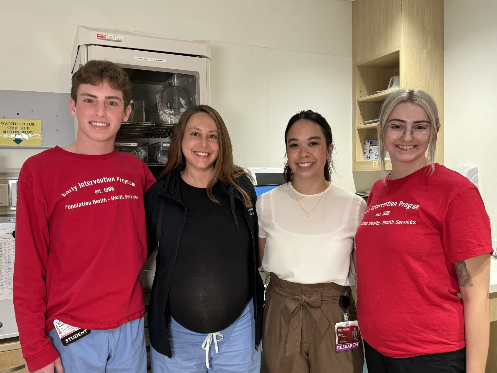

```{r setup, include=FALSE}
knitr::opts_chunk$set(echo = FALSE)
```


# In the News

UC Health wrote an article regarding the human trafficking screening done through EIP in the emergency department, which can be found here [UCHealth Insights: Human Trafficking Screening](https://www.uchealth.com/en/media-room/articles/our-fight-against-human-trafficking-with-improved-screening){target="_blank"}.

::: {.g-col-4 .text-center}

::: {#fig-eip}
{width="50em"}

Dr. Pulvino with Early Intervention Program members, from left to right, Cameron May, Elysia Smith and Meghan Mays.
:::

:::


